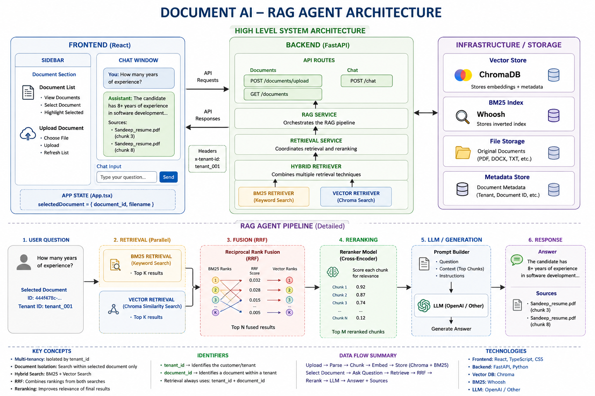

# Document AI / RAG Agent

A multi-tenant Document AI application that allows users to upload documents, index them, retrieve relevant content using hybrid search, rerank the results, and ask questions through a React UI.

The application is **document-type independent**. It is not limited to resumes and can be extended to PDFs, DOCX files, technical documents, manuals, policies, and other supported document formats.

---

## Architecture


---

---

## 1. High-Level Architecture

```text
                         USER
                           |
                           v
                    React Frontend
                           |
              +------------+------------+
              |                         |
              v                         v
        Document Upload            Chat Question
              |                         |
              +------------+------------+
                           |
                           v
                       FastAPI
                           |
                           v
                     RAG Service
                           |
                           v
                 Retrieval Service
                           |
                           v
                  Hybrid Retriever
                    /          \
                   /            \
                  v              v
             Chroma Vector      BM25
               Search          Search
                  \              /
                   \            /
                    v          v
                     RRF Fusion
                         |
                         v
                     Reranker
                         |
                         v
                  Prompt Builder
                         |
                         v
                        LLM
                         |
                         v
                 Answer + Sources
                         |
                         v
                    React UI
```


---

# 2. Project Goals

The project is designed to demonstrate a complete RAG system:

- Document upload
- Document parsing
- Document chunking
- Metadata management
- Embedding generation
- Vector search
- BM25 keyword search
- Hybrid retrieval
- Reciprocal Rank Fusion (RRF)
- Reranking
- Prompt construction
- LLM answer generation
- Source/citation display
- Tenant isolation
- Document-level isolation
- React-based UI

---

# 3. Backend Architecture

The backend is built around FastAPI and a modular RAG architecture.

```text
FastAPI
   |
   +-- Documents API
   |      |
   |      v
   |   Ingestion Service
   |      |
   |      +--> Parser
   |      |
   |      +--> Chunker
   |      |
   |      +--> Embedding Service
   |      |
   |      +--> Chroma
   |      |
   |      +--> BM25
   |
   +-- Chat API
          |
          v
      RAG Service
          |
          v
   Retrieval Service
          |
          v
   Hybrid Retriever
       /       \
      /         \
 Chroma         BM25
      \         /
       \       /
         RRF
          |
          v
       Reranker
          |
          v
    Prompt Builder
          |
          v
         LLM
```

---

# 4. Frontend Architecture

The frontend is implemented using React and TypeScript.

```text
                         App.tsx
                            |
                    selectedDocument
                     /             \
                    /               \
                   v                 v
               Sidebar          ChatWindow
                  |                  |
          +-------+-------+          |
          |               |          |
          v               v          v
   DocumentList     UploadDocument ChatInput
          |               |          |
          |               |          |
          +---------------+----------+
                          |
                          v
                      services/api.ts
                          |
                          v
                        FastAPI
```

---

# 5. Frontend Components

## App.tsx

The main parent component.

Responsibilities:

- Maintain `selectedDocument`
- Pass selected document to Sidebar
- Pass selected document to ChatWindow

Example state:

```tsx
const [selectedDocument, setSelectedDocument] =
    useState<Document | null>(null);
```

The selected document is shared between the document sidebar and chat window.

---

## Sidebar.tsx

Responsibilities:

- Display document navigation
- Display DocumentList
- Display UploadDocument
- Refresh document list after upload

The Sidebar passes document selection information to DocumentList.

---

## DocumentList.tsx

Responsibilities:

- Load documents from FastAPI
- Display uploaded documents
- Allow the user to select a document
- Highlight the selected document

The selected document is identified using its UUID:

```tsx
selectedDocument?.document_id === document.document_id
```

---

## UploadDocument.tsx

Responsibilities:

- Open the file picker
- Accept a document
- Upload the document to FastAPI
- Notify Sidebar after successful upload

After successful upload:

```text
UploadDocument
      |
      v
onUploaded()
      |
      v
Sidebar refresh
      |
      v
DocumentList
      |
      v
GET /documents
```

---

## ChatWindow.tsx

Responsibilities:

- Maintain chat messages
- Send questions to FastAPI
- Pass the selected `document_id`
- Display assistant responses
- Display sources

The important API call is:

```tsx
askQuestion(
    question,
    selectedDocument?.document_id
);
```

---

## ChatInput.tsx

Responsibilities:

- Accept the user's question
- Submit the question to ChatWindow

It does not need to know anything about Chroma, BM25, RRF, or the LLM.

---

## Message.tsx

Responsibilities:

- Display user messages
- Display assistant messages
- Display sources returned by the backend

---

## services/api.ts

This is the frontend-to-backend communication layer.

Typical functions:

```text
askQuestion()
uploadDocument()
getDocuments()
```

This keeps HTTP communication separate from UI components.

---

## types/api.ts

Contains TypeScript interfaces representing API data.

Example:

```tsx
export interface Document {
    document_id: string;
    filename: string;
    chunk_count?: number;
}

export interface Source {
    document_id: string;
    filename: string;
    chunk_index: number;
}

export interface ChatResponse {
    answer: string;
    sources: Source[];
}
```

---

# 6. Document Upload Flow

When the user uploads a document:

```text
User
 |
 v
React Upload UI
 |
 v
POST /documents/upload
 |
 v
FastAPI
 |
 v
Ingestion Service
 |
 v
Parser
 |
 v
Chunker
 |
 v
Embedding Service
 |
 +-------------------+
 |                   |
 v                   v
Chroma              BM25
 |                   |
 +-------------------+
          |
          v
     Indexed Document
```

Each chunk contains metadata such as:

```text
tenant_id
document_id
chunk_index
filename
extension
parser
```

---

# 7. Document ID

Every uploaded document has a unique UUID.

Example:

```text
Sandeep_resume.pdf
document_id = 444f478c-3b61-4282-aed3-4d12af072c4e
```

Another document:

```text
Nibha_resume.pdf
document_id = another-uuid
```

The `document_id` is used to distinguish one document from another.

This is important because multiple documents can belong to the same tenant.

---

# 8. Tenant ID

The system is designed for multiple tenants.

Example:

```text
tenant_id = tenant_001
```

The architecture uses:

```text
tenant_id
    +
document_id
```

to identify the scope of retrieval.

The frontend sends tenant information using:

```http
x-tenant-id: tenant_001
```

The selected document ID is sent with the chat request.

---

# 9. Document-Specific Chat

When the user selects:

```text
Sandeep_resume.pdf
```

the frontend stores:

```text
selectedDocument
```

The question request contains:

```json
{
  "question": "How many years of experience?",
  "document_id": "444f478c-3b61-4282-aed3-4d12af072c4e"
}
```

The backend can then restrict retrieval to that document.

This prevents information from another uploaded document from being mixed into the response.

---

# 10. React State Flow

The most important frontend concept is state.

```text
                    App.tsx
                       |
                       |
             selectedDocument
                       |
              +--------+--------+
              |                 |
              v                 v
          Sidebar          ChatWindow
              |
              v
       DocumentList
              |
          User clicks
              |
              v
     onSelectDocument(document)
              |
              v
     setSelectedDocument()
              |
              v
          App state
              |
              v
       ChatWindow receives
       selectedDocument
```

This is an example of lifting state up in React.

The parent owns the state and passes it to child components.

---

# 11. Document Selection

When the user clicks a document:

```tsx
onClick={() =>
    onSelectDocument(document)
}
```

The selected document is stored in App.tsx.

The UI checks:

```tsx
selectedDocument?.document_id === document.document_id
```

If it is true, the document receives the selected CSS class.

The selected document is visually highlighted and shows a checkmark.

---

# 12. Loading Documents

DocumentList loads documents from:

```text
GET /documents
```

The flow is:

```text
DocumentList
     |
     v
useEffect()
     |
     v
getDocuments()
     |
     v
GET /documents
     |
     v
FastAPI
     |
     v
Document list
     |
     v
setDocuments()
     |
     v
React renders documents
```

---

# 13. Chat Flow

A complete chat request flows through the application as follows:

```text
User
 |
 | "How many years of experience?"
 v
ChatInput
 |
 v
ChatWindow
 |
 v
askQuestion()
 |
 v
POST /chat
 |
 | question
 | document_id
 | tenant context
 v
FastAPI
 |
 v
RAG Service
 |
 v
Retrieval Service
 |
 v
Hybrid Retriever
 |
 +------------------+
 |                  |
 v                  v
Chroma             BM25
 |                  |
 +--------+---------+
          |
          v
         RRF
          |
          v
       Reranker
          |
          v
   Retrieved Context
          |
          v
   Prompt Builder
          |
          v
         LLM
          |
          v
       Answer
          |
          v
     FastAPI Response
          |
          v
      ChatWindow
          |
          v
        Message
```

---

# 14. Vector Search

Vector search uses embeddings.

The document chunk is converted into a numerical vector.

The user question is also converted into a vector.

Chroma finds chunks that are semantically similar to the question.

Vector search is useful when the question and document use different wording but have similar meaning.

Example:

```text
Question:
"What cloud technologies does the engineer know?"

Document:
"Experience with GCP, Dataflow, BigQuery and Pub/Sub."
```

The wording is different, but semantic search can identify the relationship.

---

# 15. BM25 Search

BM25 is keyword-based retrieval.

It is useful when exact words and terms matter.

Example:

```text
Question:
"Does the document mention Apache Beam?"
```

BM25 can strongly match the exact term:

```text
Apache Beam
```

---

# 16. Hybrid Retrieval

The system combines:

```text
Vector Search
      +
BM25
      |
      v
Hybrid Retrieval
```

Vector search provides semantic matching.

BM25 provides lexical/keyword matching.

Using both improves retrieval coverage.

---

# 17. RRF - Reciprocal Rank Fusion

The vector retriever and BM25 retriever produce their own rankings.

Example:

```text
Vector:

Chunk A -> Rank 1
Chunk B -> Rank 2
Chunk C -> Rank 3


BM25:

Chunk C -> Rank 1
Chunk A -> Rank 2
Chunk B -> Rank 3
```

RRF combines these rankings into one ranking.

```text
Vector Ranking
       +
BM25 Ranking
       |
       v
      RRF
       |
       v
Combined Ranking
```

RRF does not require the raw vector and BM25 scores to be directly comparable.

---

# 18. Reranking

After RRF, the system has a candidate set.

The reranker evaluates each candidate against the question.

Conceptually:

```text
Question
   +
Retrieved Chunk
   |
   v
Reranker
   |
   v
Relevance Score
```

The candidates are then sorted according to relevance.

This improves the quality of the context sent to the LLM.

---

# 19. Prompt Builder

After retrieval and reranking, the selected chunks become context.

Conceptually:

```text
Question
   +
Retrieved Context
   |
   v
Prompt Builder
   |
   v
LLM Prompt
```

The LLM then generates an answer using the retrieved context.

---

# 20. Sources

The backend returns source information together with the answer.

Example:

```json
{
  "answer": "The profile mentions 8+ years of experience.",
  "sources": [
    {
      "document_id": "444f478c-...",
      "filename": "Sandeep_resume.pdf",
      "chunk_index": 1
    }
  ]
}
```

The frontend displays these sources under the answer.

This provides traceability back to the retrieved document chunks.

---

# 21. Upload Refresh Flow

After uploading a document:

```text
UploadDocument
       |
       v
uploadDocument(file)
       |
       v
FastAPI
       |
       v
Successful response
       |
       v
onUploaded()
       |
       v
Sidebar changes refreshKey
       |
       v
DocumentList reloads
       |
       v
GET /documents
       |
       v
New document appears
```

---

# 22. Why Components Are Separated

Each component has one main responsibility.

```text
App
 |
 +-- State management

Sidebar
 |
 +-- Document navigation

DocumentList
 |
 +-- Display/select documents

UploadDocument
 |
 +-- Upload files

ChatWindow
 |
 +-- Conversation

ChatInput
 |
 +-- User input

Message
 |
 +-- Display messages

api.ts
 |
 +-- Backend communication
```

This makes the project easier to maintain and extend.

---

# 23. Backend Service Responsibilities

The backend follows a similar separation of responsibilities.

```text
API Layer
   |
   v
RAG Service
   |
   v
Retrieval Service
   |
   v
Hybrid Retriever
   |
   +--> Chroma Vector Store
   |
   +--> BM25 Retriever
   |
   v
RRF
   |
   v
Reranker
   |
   v
Prompt Builder
   |
   v
LLM
```

The goal is to avoid putting all RAG logic into one large class.

---

# 24. Current Capabilities

The current application supports:

- Multi-tenant architecture
- Document upload
- Document parsing
- Document chunking
- Metadata
- Embeddings
- Chroma vector search
- BM25 search
- Hybrid retrieval
- RRF
- Reranking
- Tenant filtering
- Document filtering
- FastAPI chat API
- React UI
- Document list
- Document selection
- Selected document highlighting
- Upload from UI
- Automatic document list refresh
- Chat with selected document
- Source display

---

# 25. Current User Experience

1. Open the application.
2. Upload one or more documents.
3. Documents appear in the sidebar.
4. Select a document.
5. The selected document is highlighted.
6. Ask a question.
7. The frontend sends:
   - question
   - document_id
   - tenant context
8. Backend retrieves chunks from the selected document.
9. Vector and BM25 retrieval run.
10. RRF combines their rankings.
11. Reranker improves the ranking.
12. PromptBuilder creates the LLM context.
13. LLM generates the answer.
14. Answer and sources appear in the UI.

---

# 26. Important React Concepts

For the frontend, focus on:

1. React components
2. JSX
3. useState
4. useEffect
5. Props
6. Callback props
7. Conditional rendering
8. Event handling
9. fetch()
10. async/await
11. TypeScript interfaces

---

# 27. Important RAG Concepts

For the backend, focus on:

1. Document parsing
2. Chunking
3. Metadata
4. Embeddings
5. Vector databases
6. Semantic search
7. BM25
8. Hybrid retrieval
9. RRF
10. Reranking
11. Prompt construction
12. LLM generation
13. Source attribution
14. Tenant isolation
15. Document isolation

---

# 28. Recommended Learning Order

### Frontend

```text
React Components
      ↓
JSX
      ↓
useState
      ↓
useEffect
      ↓
Props
      ↓
Callback Props
      ↓
fetch / async-await
      ↓
API integration
```

### RAG

```text
Documents
    ↓
Parsing
    ↓
Chunking
    ↓
Embeddings
    ↓
Vector Search
    ↓
BM25
    ↓
Hybrid Search
    ↓
RRF
    ↓
Reranking
    ↓
Prompt
    ↓
LLM
    ↓
Answer + Sources
```

---

# 29. Future Improvements

Potential next features:

- All-document search
- Search across multiple selected documents
- Document deletion
- Document rename
- Document metadata view
- Chat history
- Multiple chat sessions
- Streaming LLM responses
- Authentication
- Real tenant authentication
- Document processing status
- Document search/filter
- Conversation persistence
- Improved source/citation UI
- Better error handling
- Production deployment
- Monitoring and logging

---

# 30. One-Sentence Mental Model

Remember the entire application as:

```text
React selects WHAT to ask about
            ↓
FastAPI receives the request
            ↓
RAG retrieves WHERE the answer is
            ↓
Reranker decides WHAT context matters most
            ↓
LLM decides HOW to formulate the answer
            ↓
React displays the answer + sources
```

---

# 31. End-to-End Architecture

```text
                         USER
                           |
                           v
                    React Frontend
                           |
             +-------------+-------------+
             |                           |
             v                           v
       Upload Document             Select Document
             |                           |
             v                           v
        FastAPI Upload           selectedDocument
             |                           |
             v                           v
        Ingestion                  ChatWindow
             |                           |
             v                           v
     Parse / Chunk / Embed          Question
             |                           |
             +------------+              |
                          |              |
                          v              v
                     Chroma + BM25   POST /chat
                                         |
                                         v
                                      FastAPI
                                         |
                                         v
                                    RAG Service
                                         |
                                         v
                                  Hybrid Retriever
                                    /        \
                                   /          \
                                  v            v
                              Chroma         BM25
                                  \            /
                                   \          /
                                    v        v
                                      RRF
                                       |
                                       v
                                   Reranker
                                       |
                                       v
                                  Prompt Builder
                                       |
                                       v
                                      LLM
                                       |
                                       v
                                  Answer + Sources
                                       |
                                       v
                                   React UI
```

---

## Status

The current project has completed the core document-specific RAG workflow:

```text
Upload
  ↓
Parse
  ↓
Chunk
  ↓
Embed
  ↓
Index
  ↓
Select Document
  ↓
Ask Question
  ↓
Hybrid Retrieval
  ↓
RRF
  ↓
Reranking
  ↓
LLM
  ↓
Answer + Sources
```

The architecture is ready for further improvements without making the application resume-specific.

## Modern RAG principles used

- **Query Rewriting:** Converts vague or conversational questions into clearer, self-contained retrieval queries.
- **Conversation History:** Allows follow-up questions such as "What services does he use there?" to be resolved using previous turns.
- **Multi-Query Retrieval:** Generates several retrieval perspectives for the same information need to improve recall.
- **Multi-Query Fusion:** Combines candidate results from multiple queries using rank-based fusion signals.
- **Reranking:** Uses a cross-encoder to evaluate candidate relevance against the actual search query and improve final precision.
- **Query Decomposition:** Breaks genuinely complex questions into independent sub-questions instead of simply generating alternative phrasings.
- **Grouped Evidence:** Keeps evidence associated with each decomposed sub-question so the final LLM can synthesize a comparison or multi-part answer correctly.

---

# 31. Query Rewriting

Query rewriting is the first Modern RAG layer.

```text
Conversation History
        +
Current Question
        |
        v
  Query Rewriter
        |
        v
Self-contained Search Query
```

Example:

```text
Previous:
What cloud platform does Sandeep use?

Assistant:
Sandeep uses Google Cloud Platform.

Current:
What services does he use there?

Rewritten:
What services does Sandeep use on Google Cloud Platform?
```

The original question is still used for final answer generation; the rewritten query is used primarily for retrieval.

---

# 32. Conversation History

Conversation history is passed from the React chat window to FastAPI and then to the Query Rewriter.

```text
React messages
      |
      v
conversation_history
      |
      v
POST /chat
      |
      v
RagService
      |
      v
QueryRewriter
```

The frontend uses the existing chat messages as the conversation history instead of maintaining a separate history state.

This allows follow-up questions to be interpreted in context.

---

# 33. Multi-Query Retrieval

Multi-Query Retrieval creates multiple search perspectives for the same information need.

Example:

```text
Original:
What technologies does Sandeep use for real-time data processing?

Generated queries:

1. Sandeep's real-time data processing technologies
2. What tools are employed by Sandeep in real-time data processing?
3. How is the architecture designed for real-time data processing at Sandeep?
4. What real-time data processing use cases and outcomes are associated with Sandeep?
```

The generated queries are searched independently.

The purpose is primarily to improve **retrieval recall** by giving the search system several perspectives on the same information need.

---

# 34. Multi-Query Fusion

Results from the individual queries are merged by chunk ID.

A chunk that is retrieved by several independent queries provides a stronger retrieval signal.

```text
Q0 -> A B C D
Q1 -> A C E F
Q2 -> A B E G
Q3 -> A D E G

                |
                v
        Rank-based Fusion
                |
                v
      Combined Candidate Pool
```

The current implementation uses the rank of each chunk within each query to build a fusion score. The fused candidates are then sent to the reranker.

---

# 35. Reranking

The reranker is a cross-encoder that evaluates the relationship between:

```text
Question + Retrieved Chunk
```

The current implementation uses:

```text
cross-encoder/ms-marco-MiniLM-L-6-v2
```

Conceptually:

```text
Multi-Query Candidates
        |
        v
     Reranker
        |
        v
  Relevance Scores
        |
        v
      Top K
```

Multi-query and fusion improve the candidate pool; reranking performs the final relevance ordering.

---

# 36. Query Decomposition

Query Decomposition is different from Multi-Query Retrieval.

### Multi-Query

```text
One information need
        |
        +-- Query A
        +-- Query B
        +-- Query C
```

### Query Decomposition

```text
Complex information need
        |
        +-- Sub-question A
        +-- Sub-question B
        +-- Sub-question C
        +-- Sub-question D
```

Example:

```text
Compare Sandeep's Kafka and Spark experience and explain
which one was used more for real-time processing.
```

is decomposed into:

```text
1. What Kafka experience does Sandeep have?
2. What Spark experience does Sandeep have?
3. How has Sandeep used Kafka for real-time processing?
4. How has Sandeep used Spark for real-time processing?
```

Each sub-question is retrieved independently, and the evidence remains grouped by sub-question.

---

# 37. Simple vs Complex RAG Routing

The current architecture uses different paths depending on whether the question is simple or complex.

```text
                         Question
                            |
                            v
                     Query Rewriting
                            |
                            v
                    Query Decomposer
                       /          \\
                      /            \\
                 Simple              Complex
                   |                    |
                   v                    v
             Multi-Query           Decompose
                   |               Q1 Q2 Q3 Q4
                   v                    |
             Fusion + Rerank     Independent Retrieval
                   |                    |
                   |              Grouped Evidence
                   |                    |
                   +---------+----------+
                             |
                             v
                            LLM
```

This avoids automatically running expensive Multi-Query retrieval for every decomposed sub-question.

---

# 38. Modern RAG Mental Model

A useful way to remember the architecture is:

```text
Query Rewriting
    -> Make the search query clearer

Multi-Query
    -> Search from multiple perspectives

Fusion
    -> Combine candidate evidence

Reranker
    -> Choose the most relevant candidates

Decomposition
    -> Break complex questions into separate information needs

LLM
    -> Synthesize the retrieved evidence into an answer
```

Another compact mental model:

```text
Multi-Query   -> FIND MORE
Fusion        -> COMBINE
Reranker      -> CHOOSE BEST
Decomposition -> BREAK DOWN
LLM           -> SYNTHESIZE
```

---

# 39. Current Modern RAG Capabilities

The project now supports or has implemented the following Modern RAG capabilities:

- Conversation-aware query rewriting
- Query rewriting for retrieval optimization
- Multi-query generation
- Multiple hybrid retrieval passes
- Rank-based multi-query fusion
- Cross-encoder reranking
- Query decomposition for complex questions
- Grouped evidence for decomposed questions
- Document-level retrieval filtering
- Tenant-level retrieval filtering
- Source tracking

---

# 40. Evaluation - Planned Next Step

Evaluation has **not yet been implemented**. It is the next planned module.

The goal is to measure whether each RAG improvement actually improves retrieval and answer quality instead of relying only on manual inspection.

Planned structure:

```text
evaluation/
├── eval_dataset.json
├── evaluator.py
├── metrics.py
└── report.py
```

Planned retrieval metrics:

- Recall@K
- Precision@K
- MRR (Mean Reciprocal Rank)
- Hit Rate
- NDCG

Planned generation-level evaluation:

- Answer relevance
- Faithfulness / groundedness
- Context relevance
- Source / citation correctness

The evaluation framework will allow comparison between stages such as:

```text
Baseline RAG
      vs
Hybrid RAG
      vs
+ Query Rewriting
      vs
+ Multi-Query
      vs
+ Reranking
      vs
+ Query Decomposition
      vs
Full Modern RAG
```

---

# 41. Updated Learning Order

### Frontend

```text
React Components
      ↓
JSX
      ↓
useState
      ↓
useEffect
      ↓
Props
      ↓
Callback Props
      ↓
fetch / async-await
      ↓
API integration
      ↓
Conversation state
```

### RAG fundamentals

```text
Documents
    ↓
Parsing
    ↓
Chunking
    ↓
Embeddings
    ↓
Vector Search
    ↓
BM25
    ↓
Hybrid Search
    ↓
RRF
    ↓
Reranking
    ↓
Prompt
    ↓
LLM
```

### Modern RAG

```text
Query Rewriting
      ↓
Conversation-aware retrieval
      ↓
Multi-Query Retrieval
      ↓
Multi-Query Fusion
      ↓
Reranking
      ↓
Query Decomposition
      ↓
Grouped Evidence / Synthesis
      ↓
RAG Evaluation
      ↓
Parent-Child Retrieval
      ↓
Contextual Compression
      ↓
Self-Corrective RAG
      ↓
Agentic RAG
```

---

# 42. Updated End-to-End Architecture

```text
                             USER
                               |
                               v
                        React Frontend
                               |
                +--------------+--------------+
                |                             |
                v                             v
          Document Upload                 Chat Question
                |                             |
                v                             v
             FastAPI                      Chat API
                |                             |
                v                             v
        Ingestion Service                  RAG Service
                |                             |
       +--------+--------+          +---------+---------+
       |        |        |          |         |         |
       v        v        v          v         v         v
     Parse    Chunk    Embed    Rewrite   Decompose  History
       |        |        |          |         |
       +--------+--------+          |      Simple / Complex
                |                   |         /      \\
           Chroma + BM25           |        /        \\
                                   |   Multi-Query   Sub-Qs
                                   |        |           |
                                   |      Fusion      Retrieval
                                   |        |           |
                                   |      Rerank     Group Evidence
                                   |        |           |
                                   +--------+-----------+
                                            |
                                            v
                                      Prompt / Synthesis
                                            |
                                            v
                                           LLM
                                            |
                                            v
                                      Answer + Sources
                                            |
                                            v
                                       React UI
```

---

# 43. Next Planned Work

The immediate next engineering task is **RAG evaluation**.

After evaluation is in place, the system can be measured objectively before adding further Modern RAG techniques such as parent-child retrieval, contextual compression, self-corrective retrieval, and agentic RAG.

---
